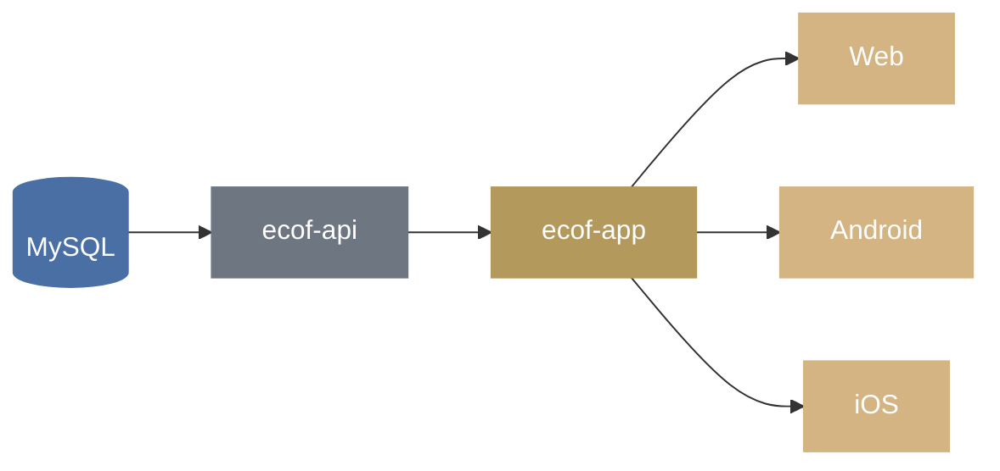

<p align="center">
  
</p>

<p align="center">
  Backend API for the <em>Eglise Catholique Orthodoxe de France</em> mobile application.
</p>

<p align="center">
  
  
  
</p>

---

## About

`ecof-api` is the backend serving the [ecof-app](https://github.com/jrc0de/ecof-app) mobile application. It provides parish data, the liturgical calendar, saints' lives (vita), daily readings, the synaxarion, news, and other content consumed by the app.

The API is built with [Hono](https://hono.dev/) on the [Bun](https://bun.sh/) runtime, and stores its data in MySQL.

## Architecture



## API Routes

All routes are prefixed with `/api`.

| Route         | Description                          |
| ------------- | ------------------------------------ |
| `/calendar`   | Liturgical calendar (iCalendar)      |
| `/parish`     | Parish directory                     |
| `/vita`       | Saints' lives                        |
| `/news`       | News and articles (Markdown content) |
| `/reading`    | Daily liturgical readings            |
| `/synaxar`    | Synaxarion (calendar of saints)      |
| `/images`     | Image assets                         |
| `/privacy`    | Privacy policy content               |
| `/support`    | Support / contact information        |
| `/monitoring` | Vita content monitoring              |
| `/app-config` | Mobile app configuration             |
| `/map-data`   | Map data for the parish map          |

## Tech Stack

| Layer                | Technology                                                                       |
| -------------------- | -------------------------------------------------------------------------------- |
| Runtime              | [Bun](https://bun.sh/)                                                           |
| Framework            | [Hono](https://hono.dev/)                                                        |
| Database             | MySQL                                                                            |
| Calendar parsing     | [ical.js](https://github.com/kewisch/ical.js)                                    |
| Markdown rendering   | [marked](https://marked.js.org/)                                                 |
| Linting / formatting | [oxlint](https://oxc.rs/docs/guide/usage/linter.html) + [oxfmt](https://oxc.rs/) |

## Getting Started

### Prerequisites

- [Bun](https://bun.sh/)
- A MySQL database instance

### Installation

```bash
git clone https://github.com/jrc0de/ecof-api.git
cd ecof-api
bun install
```

### Configuration

The API connects to a MySQL database.

### Development

Run the API with hot reload:

```bash
bun run dev
```

## Linting & Formatting

```bash
bun run lint        # check for lint issues
bun run lint:fix     # auto-fix lint issues
bun run fmt          # format code
```

## Related Projects

- [ecof-app](https://github.com/jrc0de/ecof-app) — official mobile and web application (Ionic Vue + Capacitor) consuming this API

## License

This project is licensed under the [MIT License](LICENSE).
